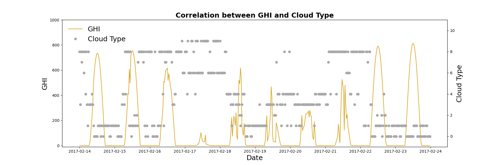
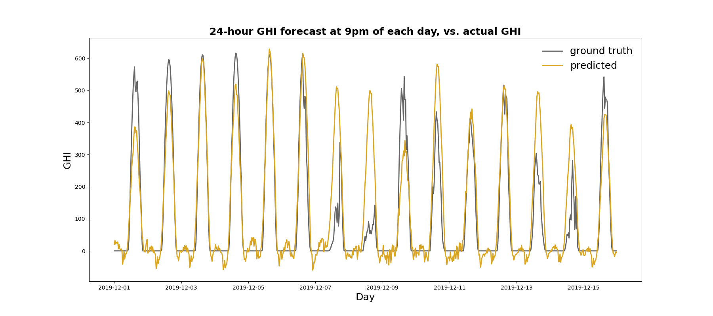

# Project 4 - Solar Intensity Forecasting

By Andres Aguilar (insert email here)  
Martijn de Vries (martijndevries91@gmail.com)  
and William Lopez (insert email here)

## Problem Statement

One of the problems faced with integration of renewable energies into the power grid is the reliability of power output forecasting from sources such as wind and solar. As data scientists, we have been tasked by the energy company PG&E with creating reliable predictions for solar intensity, which directly correlates to solar power output.

Using weather data from the National Solar Radiation Database, we will build a predictive model to forecast the solar intensity in Los Angeles, one day in advance. We will use the root mean squared error and the mean absolute error to evaluate the success of our model, and compare the model scores  against a benchmark model of a solar intensity curve on an average day. Our predictive model can then be used to determine the amount of solar power that can be generated on a given day, such that other, non-renewable sources of energy production can be throttled or ramped up accordingly.

## Repository Overview
    
This repository consists of the following:

<ul>
   <li> The directory <code>./code</code> contains 6 notebooks that go through each of the steps of the analysis: 
   <ol>
    <li> In <b>data_collection.ipynb</b>, we collected 5 years of weather data (2016 - 2020) from the NSRDB database </li>
    <li> In <b>EDA.ipynb</b> we look at the data and investigate seasonal trends. We also engineer several new features </li> 
    <li> In <b>neural_prophet.ipynb</b>, we use Facebook's Neural Prophet model, a hybrid between a neural network and traditional time series methods. This model takes current GHI values to forecast the GHI into the future.</li>
    <li> In <b>RNN_model.ipynb</b>, we use a Recurrent Neural Network to forecast the GHI 1 day into the future, based on the weather data from the previous 4 days </li>
    <li> In <b>WaveNet_model.ipynb,</b> we apply a modified version of Google's generative WaveNet model to forecasting GHI 1 day in the future based on the weather conditions on the previous 10 days.</li>
    <li> Finally, in <b>modeling_insights.ipynb</b>, we establish the baseline model, evaluate and compare our 3 models, and draw our conclusions</li>
   </ol>
  <li> The directory <code>./data</code> contains 1) the dataframe as collected from the NSRDB, and 2) the cleaned, feature engineered dataframe that is used for the various models.
   <li> The directory <code>./figures</code> contains all the figures that are saved during the analysis in the notebooks, in .png formats </li>
    <li> The slides for the project presentation are in the file <code>project4_solar.pdf</code> </li>
</ul>

## Software Requirements

To run all the notebooks, the following python packages are required:
1) Pandas
2) Numpy
3) Matplotlib
4) Seaborn 
5) Scikit-learn
6) Tensorflow.keras
7) Tensorflow_addons
8) Neuralprophet
9) Plotly

## Dataset and approach

As the world is slowly transitioning away from fossil fuels, the issue of how to integrate renewable sources energy into the power grid has become more and more relevant. Energy sources like wind and solar energy can vary on timescales of hours or even shorter, and thus a combination of increased energy storage and careful forecasting is becoming necessary in order to ensure that energy supply can meet demand. Reliably forecasting how much solar energy can be extracted in a given location can therefore be of great importance.

In this project, we will use the 'Global Horizontal Irradiance' (or GHI) as a proxy to model how much solar power can be generated in a given area. The GHI is a measurement of how much energy is received by a surface horizontal to the ground (for an overview, see eg. <a href=https://www.sciencedirect.com/topics/engineering/global-horizontal-irradiance>here</a>). This quantity in particular correlates well with how much energy can be extracted by photovoltaic systems, and is thus of particular interest.

The data that we used is obtained from the <a href=https://nsrdb.nrel.gov/>National Solar Radiation Database</a>, or NSRDB. The NSRDB is a freely available database that has weather data available at a 2x2km resolution at half-hour intervals. The data is collected from various satellites (more information <a href=https://nsrdb.nrel.gov/data-sets/us-data>here</a>). The collected weather data is then used to model solar irradiance parameters, such as the GHI and the DNI (Direct Normal Irradiance). 

We have used the NSRDB data in two different ways: Firstly, the GHI itself can be analysed as a time series, and used to forecast the GHI into the future. Although this is the easiest from a modeling perspective, it does require a GHI model, which may not always be available. The second approach is to use the time series of weather data to forecast GHI into the future. This approach is slightly more complex from a modeling perspective, but does mean that the GHI could be forecast with more 'fundamental' weather data. 

## Data Dictionary

|Feature|Type|Dataset|Description|
|---|---|---|---|
|Dew Point| Numerical |NSDRB | Defined as 'the temperature to which air must be cooled to become saturated with water vapor', in degrees Celsius |
|Pressure| Numerical |NSDRB | Air pressure in Millibar | 
|Relative Humidity| Numerical |NSDRB |Percentage of water vapor in the air |
|Temperature| Numerical |NSDRB | Air temperature in degrees Celsius | 
|Wind_x| Numerical | NSDRB | X-component of wind velocity. Feature engineered from Wind direction and speed|
|Wind_y| Numerical | NSDRB | y-component of wind velocity. Feature engineered from Wind direction and speed|
|Day Seasonality | Numerical | NSDRB | Sinoid function that captures daily variance in the GHI. Feature engineered |
|Year Seasonality | Numerical | NSDRB | Sinoid function that captures yearly variance in the GHI. Feature engineered |
|Cloud Type | Categorical | NSDRB | Categorical variable indicating type of cloud. See notebook for more details |
|GHI| numerical| NSDRB| ***Target variable***- Global Horizontal Irradiance in W/m2|

## Data Collection and EDA

To collect the data, we used the api available from the NSRDB to directly read to a csv using a url format. To run the data collection notebook, one needs an api token from the NSRDB that can be obtained [here](https://developer.nrel.gov/signup/).

We collected data from 2016 to the most recent available year of 2020, which resulted in a 5 year time period of 30 minute intervals. This data included sensor collected weather features, sensor collected Solar Irradiance values, such as DHI and DNI, and model predict GHI values from NSRDB algorithms.  

On inspection, the data appears completely clean with all the features of interest having values within expected ranges. One feature we investigated in a little more detail is 'Cloud Type'. This is a categorical feature where different types of clouds have different ranging from 0 to 12, although there appears to be some ordinality in the labels in that higher-level labels seem to indicate clouds that block more light. An example is shown below, for a few days in February 2017:

 
 
This emphasizes 1) the effect that clouds can have on the GHI curve and 2) the relatively short timescales in which clouds can appear or reappear. As we will in the modeling, these relatively short time-scale features are difficult to forecast.

During the EDA process we also engineered several new features. 'Wind Direction' is not a great feature to use without further processing, because of the way that circles wrap around - an angle of 360 degrees corresponds to an angle of 0 degrees. Instead, we decomposed  'Wind Direction' and 'Wind Speed' into Wind x and y components. Secondly, we added sinoid functions with the period of a day and a year, to help model the very strong daily and yearly seasonality of the sun.

## Modeling

We decided to forecast our target variable, GHI, using 3 different models:

_Neural Prophet model_
- The [Neural Prophet](https://arxiv.org/abs/2111.15397?fbclid=IwAR2vCkHYiy5yuPPjWXpJgAJs-uD5NkH4liORt1ch4a6X_kmpMqagGtXyez4) is the successor to the original FBProphet, which was created by Facebook. In this [article](https://medium.com/analytics-vidhya/neuralprophet-a-neural-network-based-time-series-model-3c74af3b0ec6) we see the potential of Neural Prophet's ability to predict weather data, in this [article](https://medium.com/analytics-vidhya/neuralprophet-a-neural-network-based-time-series-model-3c74af3b0ec6) it was used to predict rain in Australia. Our goal was to use a similar application to predict _Global Horizontal Irradiation_ using this model.
    - We used the model to predict 200 points into the most recent testing data, this gave us an insight into about 4 days and 4 hours. Neural Prophet has automatic selection of training hyperparameters and it also allows for plotting of forecast components which show us the trend, yearly, weekly, and daily seasonality.
 

  
    
 _RNN model_
- A Recurrent Neural Network is a neural network in which the output of one of the network layers can feed back into the system, and influence the input that the layer receives. This stands in contrast to a traditional feed-forward network, where information is always passed from one layer to the next. The recurrent behaviour makes it particularly suited for time series modeling (see eg. <a href=https://www.mlq.ai/rnn-lstm-time-series-forecasting-tensorflow/#:~:text=A%20recurrent%20neural%20network%20(RNN,to%20process%20sequences%20of%20inputs.>here</a>). For this model we used the weather data from the NSRDB, and used the previous 192 timesteps (4 days) to predict 48 timesteps (1 day) into the future. Although we experimented a fair amount, we ultimately landed on a simple network topology with 2 LSTM layers (LSTM = Long-short term memory, a type of recurrent network layer), and a Dense output layer. We also tried a polynomial feature expansion for the numerical variables, and found that this performs marginally better. An example forecast for a handful of days (where the forecast for each day is made at 9pm, for the subsequent 24hours), can be seen in the plot below.

 

_WaveNet model_
- In our analysis, we used a modifidied version of the model described in this [paper](https://arxiv.org/pdf/1609.03499.pdf). The model described in the model is used as a generative model for audio signals.The main feature of the model is the use of _dilated_ convolutional layers for sequencing, as opposed to the conventional recurrent layers. We decided to use this model because it would be well suited for predictions of large sequences, which in our case would be a large amount of time steps. 
- Our approach had a couple changes to the model:
    - First, instead of a _sigmoid_ activation in the Gated Activation Layers, we used a _relu_ activation because this [paper](https://arxiv.org/pdf/1703.04691.pdf) on dilated convolutions suggests it is a more suited activation to a non-stationary time-series, which GHI is because of it's seasonality.
    - Secondly, a linear dense layer was used as the output to create predictions for each time step in the future according to the number of output neurons. 

## Insights

We established our baseline model by taking the the 1827 daily GHI curves from our 5-year dataset, and averaging these 1827 daily curves. Additionally, we only score our models for timestamps where the solar zenith angle is below 90 degrees, i.e. when the sun is up. Because we care about how much solar energy can be extracted, our predictions when the sun is down are irrelevant. An overview of the baseline and individual model scores can be seen in the table below.

### Model scores (after filtering for Solar Zenith Angle)
|Model|Training RMSE|Testing RMSE|Training MAE|Testing MAE|
|---|---|---|---|---|
|Baseline | N/A  | 198.4 | N/A | 160.7 |
|Neural Prophet|101.6|109.2|59.2|88.7 |
|RNN| 106.5 | 119.9 | 72.1 | 78.0 |
|WaveNet|enter data|enter data|enter data|enter data|

## Conclusions
